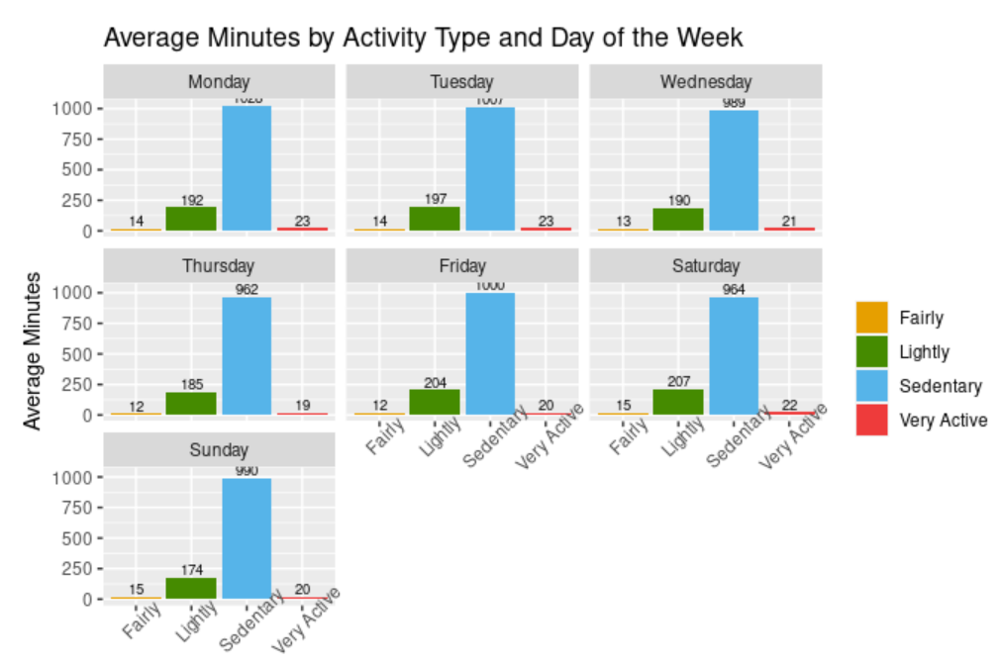
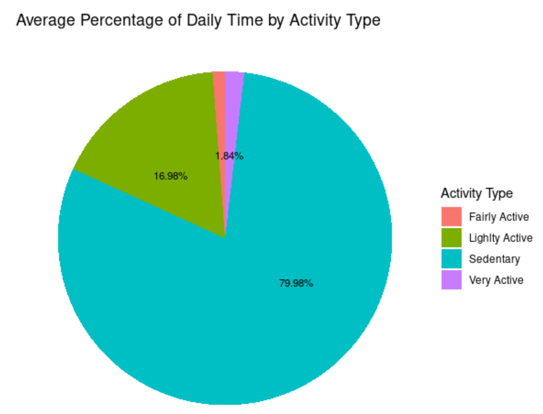
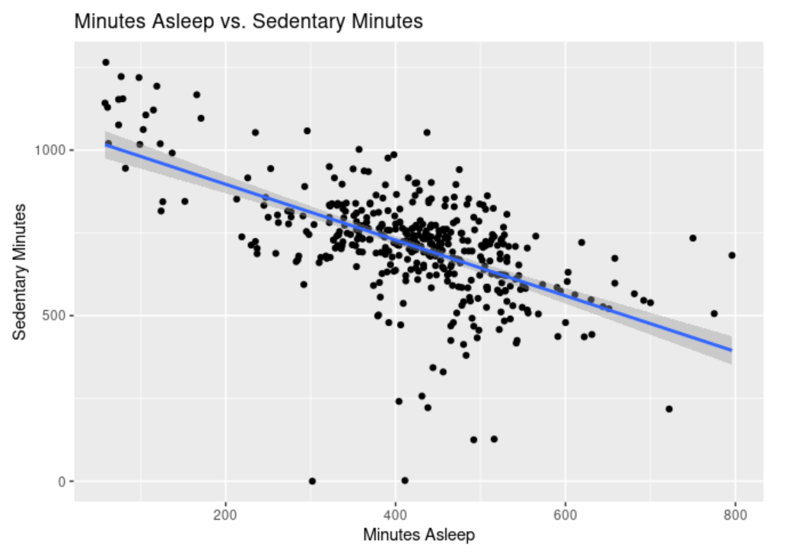
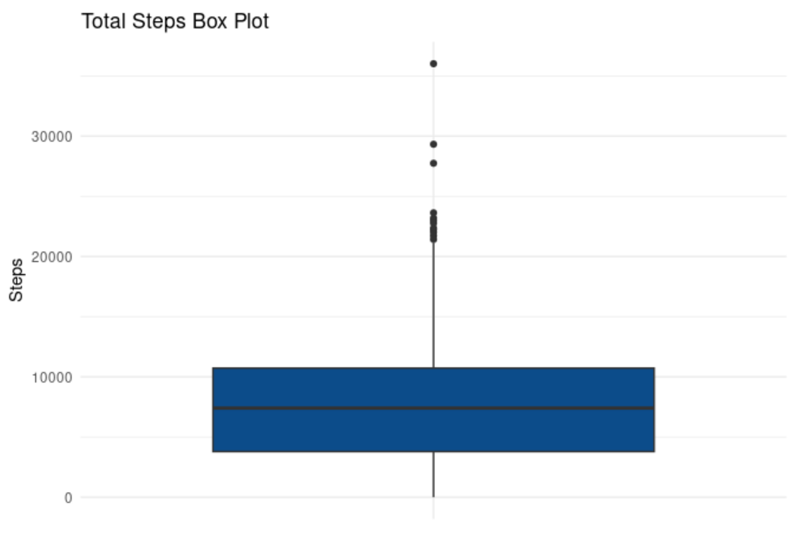
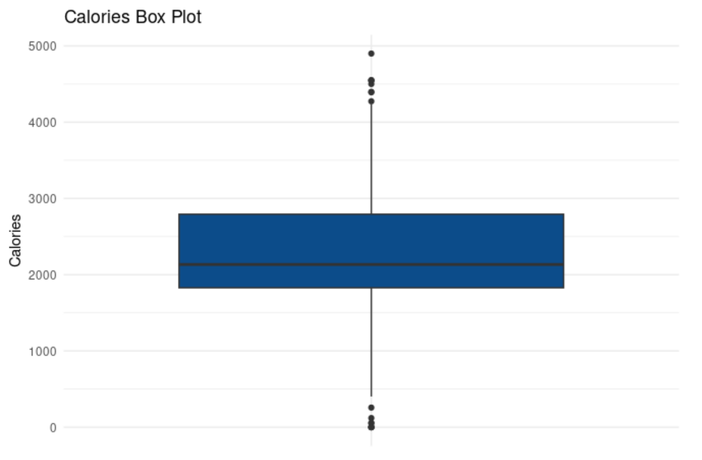

<h1 align="center">Bellabeat Case Study — Data Analysis</h1>

A data analysis project exploring user activity patterns using Fitbit data to generate insights and marketing recommendations for Bellabeat.

This project was completed as the capstone project for the Google Data Analytics Professional Certificate, demonstrating end-to-end data analysis from data cleaning to business recommendations.

<h2>Project Overview</h2>

This project is part of the Google Data Analytics Professional Certificate capstone. The objective is to analyze user activity data from Fitbit devices to identify trends in physical activity, sleep, and sedentary behavior, and to provide actionable recommendations for Bellabeat’s marketing strategy.

<h2>About the Company</h2>

Bellabeat is a high-tech company that manufactures health-focused smart products designed primarily for women. The company collects data on activity, sleep, and overall wellness to help users make informed health decisions.

<h2>Business Task</h2>

Analyze smart device usage data to gain insights into how consumers use non-Bellabeat devices and apply these insights to improve Bellabeat’s marketing strategy.

<h2>Data Source</h2>

<ul>
<li>FitBit Fitness Tracker Data (Public dataset from Kaggle)</li>
<li>Data collected from 33 users over a 31-day period</li>
</ul>

<h2>Analysis & Visualizations</h2>

<h3>Average Activity by Day of the Week</h3>

  

Users tend to exercise vigorously (Very Active) during the first days of the week (Monday, Tuesdays), and have more Light and Fairly activity minutes during the weekend. 

---

<h3>Activity as Percentage of Daily Time</h3>

  

Approximately 80% of daily time is spent in sedentary activities, with only a small percentage dedicated to moderate and vigorous activity.

---

<h3>Sleep and Sedentary Time</h3>

  

Minutes Asleep and Sedentary Minutes show a negative relationship. Sedentary time doesn’t lead to a healthy lifestyle, and more sedentary time is related to less sleep.

---

<h3>Additional Visualizations</h3>

  
  

Additional analyses include box plots for steps, calories, and sleep, as well as correlation and hourly trend analyses.

<h2>Key Findings</h2>

<ul>
<li>Users spend approximately <b>80% of their time in sedentary activities</b></li>
<li>Light activity accounts for ~17% of daily activity</li>
<li>Users are more active early in the week than on weekends</li>
<li>Daily steps are generally below the recommended 10,000 steps</li>
</ul>

<h2>Data Limitations</h2>

<ul>
<li>Small sample size (33 users, fewer for sleep and weight data)</li>
<li>Lack of demographic information</li>
<li>Data collected in 2016 (not recent)</li>
<li>Possible inconsistencies in recorded activity</li>
</ul>

<h2>Recommendations</h2>

<ul>
<li>Promote increased daily activity and step goals</li>
<li>Highlight benefits such as improved sleep and reduced stress</li>
<li>Leverage reminders and tracking features</li>
<li>Enhance marketing through PPC, social media, and display ads</li>
</ul>

<h2>Key Skills Demonstrated</h2>

<ul>
<li>Data cleaning and transformation (R)</li>
<li>Exploratory data analysis (EDA)</li>
<li>Data visualization (ggplot2)</li>
<li>Business insight generation</li>
</ul>

<h2>License</h2>

This project is licensed under the MIT License.

